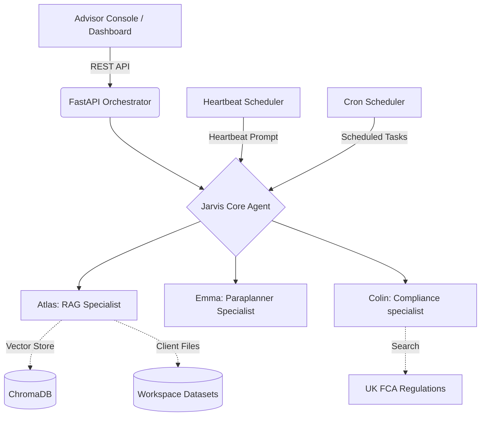

# Jarvis Project Report: End-to-End Analysis
**Date:** 2026-02-08
**Status:** Deep-Dive Analysis Complete

## 1. Project Overview
Jarvis is a proactive AI agent system specifically tailored for Independent Financial Advisors (IFAs). It moves beyond standard reactive chatbots by implementing autonomous monitoring and a "Board of Specialists" architecture to handle complex wealth management workflows.

---

## 2. Technical Architecture & Agent Orchestration

### Agent Hierarchy (Mermaid Diagram)

### Jarvis: The Orchestrator (`deepagent.py`)
- **Backend**: Uses `FilesystemBackend` for persistent tool memory and virtual file operations.
- **Middleware**: Implements `ModelRetryMiddleware` to handle LLM rate limits and transient errors.
- **Identity Synthesis**: Dynamically reads `SOUL.md`, `IDENTITY.md`, `USER.md`, and `HEARTBEAT.md` into the system prompt.
- **Decision Logic**: If an input matches a "greeting" but lacks specific instructions, it can emit `NO_REPLY` to save tokens.

### The Specialist Sub-Agents
| Agent | Role | Tools | Communication Style |
| :--- | :--- | :--- | :--- |
| **Atlas** | RAG Specialist | `retrieve_context` | Fact-based, concise, data-driven. |
| **Emma** | Paraplanner | N/A (Internal) | Formatted as Suitability Reports, professional, warm. |
| **Colin** | Compliance | `search_uk_compliance` | Binary PASS/FAIL with regulation citations. |

---

## 3. Data Flow & Knowledge Management

### Knowledge Sources
- **Long-term Knowledge**: ChromaDB stores embeddings for large policy documents and advisor manuals.
- **Short-term Context (Short-term context)**:
    - `crm.json`: Metadata about client risk profiles, income, and assets.
    - `email_archive/`: Raw historical email context.
    - `meeting_transcripts/`: Raw meeting notes.
- **Temporal Memory**: `workspace/memory/*.md` stores daily logs of advisor-Jarvis interactions and heartbeat outcomes.

### Vector Store Implementation (`vector_store.py`)
- **Embedding Model**: Uses `intfloat/multilingual-e5-large` (via WatsonX) with a fallback to `FakeEmbeddings` for testing.
- **Chunking Strategy**: `RecursiveCharacterTextSplitter` with 1000-character chunks and 200-character overlap.

---

## 4. Proactive Intelligence Logic

### The Heartbeat Mechanism (`jarvis_heartbeat.py`)
The heartbeat is the proactive core of Jarvis. Every 30 minutes, the following sequence occurs:
1. **Wake-up**: The scheduler triggers a request to the Jarvis agent with the content of `HEARTBEAT_PROMPT`.
2. **Context Intake**: Jarvis reads `SOUL.md`, `USER.md`, `MEMORY.md`, and `HEARTBEAT.md`.
3. **Delta Detection**: Jarvis uses `find_files_updated_after(minutes=30)` to see what documents changed since the last pulse.
4. **Autonomous Analysis**: 
    - If a new email is found, Jarvis reads it.
    - If the email implies a risk (e.g., "I'm worried about my health"), Jarvis triggers Atlas to check previous protection policies.
    - If an action is needed, Jarvis drafts a notification.
5. **Dashboard Delivery**: The notification is POSTed to the `/api/notifications` endpoint and displayed to the advisor.

### The Scheduler Tool (`scheduler.py`)
Allows Jarvis to "schedule" its own future actions. This is implemented using `APScheduler`:
- **Persistence**: Jobs are kept in memory and listed via `/api/scheduled-tasks`.
- **Dynamic Tasking**: When a cron job triggers, it spawns a fresh Jarvis instance to perform the task described in the job's metadata.

---

## 5. Tool Inventory (Custom)

| Tool | Purpose | Source |
| :--- | :--- | :--- |
| `get_market_news` | Fetches live UK financial news via Tavily. | `news.py` |
| `find_files_updated_after` | Relative path detection for workspace changes. | `file_monitor.py` |
| `retrieve_context` | Vector search across client documents. | `atlas.py` |
| `search_uk_compliance` | Live FCA regulatory search. | `colin.py` |
| `add_cron_job` | Dynamically schedules periodic system tasks. | `scheduler.py` |

---

## 6. Frontend: User Interface
The dashboard is designed for high observability:
- **Notification Panel**: Differentiates between `info`, `warning`, `action`, and `success` to prioritize advisor attention.
- **Client Files Page**: Combines directory listing with a file upload utility that separates "Transcripts" from "Emails" for better indexing.
- **Chat Interface**: Allows switching between "Jarvis" (Generalist) and Specialists for targeted tasks.

---

## 7. Demo Scenarios & Validation

### Scenario A: Reactive Urgency Check ("The 10-Day Sweep")
**Advisor Query**: *"Show me anything in the last 10 days that looks urgent across my book (emails and meeting notes)?"*
- **Behind the Scenes**: 
    1. Jarvis enters a "Sweep Mode" defined in `deepagent.py`.
    2. It scans `datasets/**/email_archive/*.txt` and `datasets/**/meeting_transcripts/*.txt`.
    3. It filters files by date (e.g., from 2026-01-28 to 2026-02-08).
    4. For each relevant file, it invokes **Atlas** to extract specific risks or action items.
- **Output**: A summarized report of all urgent client matters from the past 10 days, categorized by client name with recommended next steps.

### Scenario B: Proactive Heartbeat Alert (Gareth Cheeseman)
**The Setup**: Advisor receives a new email from Gareth Cheeseman (`sample/2026-02-01_ill_situation.txt`) where he mentions being ill and asking about income protection.
- **The Action**: Advisor uploads this file to **Gareth Cheeseman's** email archive via the "Client Files" dashboard.
- **Proactive Logic**:
    1. The **Heartbeat** script (`jarvis_heartbeat.py`) wakes up every 30 minutes.
    2. It calls `find_files_updated_after(minutes=30)`.
    3. It detects the new upload for Gareth.
    4. Jarvis reads the email and cross-references it with Gareth's `crm.json` and previous meeting transcripts.
    5. **Atlas** is asked for a recommendation.
    6. **Colin** verifies the recommendation against FCA rules.
- **Result**: A notification appears on the Advisor's dashboard: *"🚨 Jarvis Alert: New email from Gareth Cheeseman regarding income protection reviews due to illness."*

---

## 8. Strategic Value & Future Evolution
- **Self-Correcting Prompts**: Jarvis has the directive to update its own `HEARTBEAT.md` or `AGENTS.md` if it identifies a pattern that can be improved.
- **UK Compliance vertical focus**: The `Colin` agent coupled with live Tavily searches ensures that advice remains current with shifting FCA guidelines.